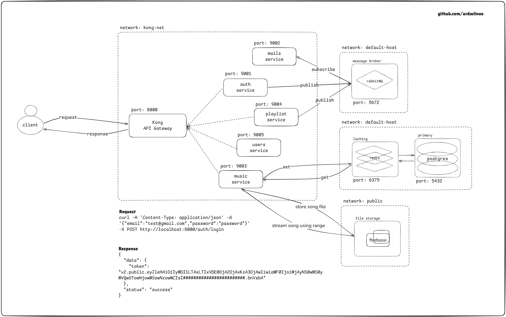

# Micro Music

This is a mini project I created to explore REST API with Golang and to learn about microservices.



There are a few things you need to prepare to run this project, but don't worry, all you need is Docker and a lot of Memory, lol.

full documentation will follow

## Features

-   REST API implementation with Golang (Fiber)
-   Microservices architecture
-   Dockerized services
-   Basic CRUD operations & Authentication using PASETO V2

## Getting Started

To get started with this project, follow these steps:

1. Clone the repository:
    ```sh
    git clone https://github.com/ardwiinoo/micro-music.git
    ```
2. Navigate to the project directory:
    ```sh
    cd micro-music
    ```
3. Build and run the services using Docker:
    ```sh
    docker-compose up --build
    ```

## Contributing

Contributions are welcome! Please fork the repository and create a pull request.

## License

This project is licensed under the MIT License.
